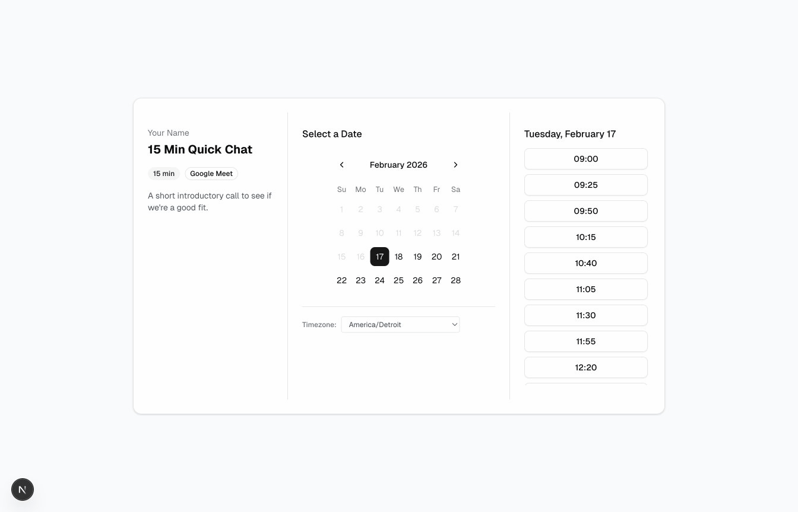

# Calendez

### Your own Calendly — free, self-hosted, set up in one prompt.

**Live demo:** [calendez.vercel.app](https://calendez.vercel.app)

Calendez is a self-hosted booking page that connects to your Google Calendar. Visitors pick a time, it checks your availability, creates the event, and sends them an invitation — just like Calendly, but it's yours. No database needed (Google Calendar *is* the database), and it runs free on Vercel.

## Features

- Multiple event types (15 min, 30 min, 60 min — or whatever you want)
- Google Calendar integration — reads your availability, creates events
- Automatic email invitations via Google Calendar
- Admin dashboard to manage event types, working hours, and branding
- Timezone-aware scheduling for visitors worldwide
- No database required — Google Calendar stores bookings, config lives in a defaults file
- Optional Upstash Redis for live admin config editing
- Free to host on Vercel



## Set Up With Claude Code

The fastest way to get Calendez running is with [Claude Code](https://claude.ai/download) — an AI coding assistant that runs on your computer. It can install the project, configure Google Cloud in your browser, and deploy it to Vercel, all from a single prompt.

**What you need:** A Google account (for Calendar access) and [Claude Code](https://claude.ai/download) installed.

**The prompt — copy, paste, done:**

```
Read the README at https://github.com/rbfyfe/calendez and help me set it up from scratch.
```

**What happens next:**

1. Claude clones the project and installs dependencies
2. Claude opens Google Cloud Console **in your browser** and configures the Calendar API for you
3. Claude creates your environment configuration
4. Claude starts the app locally so you can test it
5. Claude deploys it to Vercel when you're ready

Claude explains each step before taking action and asks your permission before doing anything in your browser. You can see everything it does and stop it at any time — like screen-sharing with a helpful friend.

## How It Works

1. You configure your event types and working hours in the admin dashboard
2. Visitors pick an event type, date, and time slot
3. The server checks your Google Calendar for conflicts via the FreeBusy API
4. When a visitor books, a Google Calendar event is created with them as an attendee
5. Google automatically sends them a calendar invitation email

## Tech Stack

- **Framework**: Next.js 16 (App Router), TypeScript
- **UI**: Tailwind CSS v4 + shadcn/ui
- **Auth**: Auth.js v5 with Google OAuth
- **Calendar**: Google Calendar API via `@googleapis/calendar`
- **Config**: Defaults file (+ optional Upstash Redis for live editing)
- **Hosting**: Vercel (free tier)

<details>
<summary><strong>Manual Setup (without Claude Code)</strong></summary>

### Prerequisites

- Node.js 18+
- A Google account
- A Vercel account (free tier works)

### 1. Fork and install

Fork this repo, then:

```bash
git clone https://github.com/YOUR_USERNAME/calendez.git
cd calendez
npm install
```

### 2. Set up Google Cloud Console

1. Go to [Google Cloud Console](https://console.cloud.google.com/) and create a new project
2. Enable the **Google Calendar API**: APIs & Services > Library > search "Google Calendar API" > Enable
3. Configure the **OAuth consent screen**: APIs & Services > OAuth consent screen
   - User type: External
   - App name: "Calendez"
   - Add your email as a test user
   - Add scopes: `calendar.freebusy` and `calendar.events`
4. Create **OAuth credentials**: APIs & Services > Credentials > Create Credentials > OAuth 2.0 Client ID
   - Application type: Web application
   - Name: "Calendez"
   - Authorized redirect URI: `http://localhost:3000/api/auth/callback/google`
5. Copy the **Client ID** and **Client Secret**

### 3. Configure environment variables

```bash
cp .env.example .env.local
```

| Variable | Description | Where to get it |
|----------|-------------|-----------------|
| `GOOGLE_CLIENT_ID` | Google OAuth client ID | Google Cloud Console > Credentials |
| `GOOGLE_CLIENT_SECRET` | Google OAuth client secret | Google Cloud Console > Credentials |
| `AUTH_SECRET` | Random secret for session encryption | Run: `openssl rand -base64 32` |
| `OWNER_EMAIL` | Your Google email (for admin access) | Your Gmail address |
| `KV_REST_API_URL` | Upstash Redis URL (optional) | Vercel Storage or Upstash dashboard |
| `KV_REST_API_TOKEN` | Upstash Redis token (optional) | Vercel Storage or Upstash dashboard |
| `ENCRYPTED_OWNER_REFRESH_TOKEN` | Encrypted token (only without Redis) | Generated at /admin after sign-in |

**Redis is optional.** Without it, config comes from `calendez.config.defaults.ts`. For production token storage without Redis, sign in at `/admin` locally, copy the encrypted refresh token shown, and set it as `ENCRYPTED_OWNER_REFRESH_TOKEN` in Vercel.

### 4. Run locally

```bash
npm run dev
```

1. Visit `http://localhost:3000/admin` to connect your Google Calendar
2. Visit `http://localhost:3000` to see the booking page

### 5. Deploy to Vercel

1. Push your fork to GitHub
2. Import the project in [Vercel](https://vercel.com/new)
3. Add environment variables (`GOOGLE_CLIENT_ID`, `GOOGLE_CLIENT_SECRET`, `AUTH_SECRET`, `OWNER_EMAIL`)
4. **Choose one** for token storage:
   - **With Redis (recommended):** Create a KV store in Vercel dashboard (Storage > Upstash for Redis), connect it to the project
   - **Without Redis:** Add `ENCRYPTED_OWNER_REFRESH_TOKEN` from your local `/admin` page
5. Add the production redirect URI to Google Cloud Console:
   `https://your-app.vercel.app/api/auth/callback/google`
6. Deploy and visit `/admin` on your production URL to connect Google Calendar

</details>

## Development

```bash
npm run dev    # Start dev server (port 3000)
npm run build  # Production build
npm run lint   # Run ESLint
```

## For AI Agents

If you are an AI coding assistant helping someone set up this project, read `CLAUDE.md` in the project root for a complete step-by-step setup guide — including browser automation workflows for Google Cloud Console and Vercel deployment.
